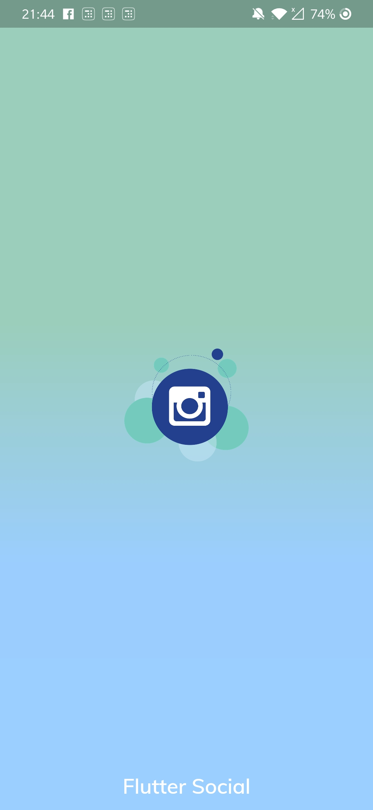

# advanced_splashscreen

Advanced splash screen

### Screenshots

 

## Usage

[Example](https://github.com/apoorv9496/Flutter-advanced-splash-screen/blob/master/example/example.dart)

To use this package :

* add the dependency to your [pubspec.yaml](https://github.com/iampawan/Flutter-Walkthrough/blob/master/pubspec.yaml) file.

```yaml
  dependencies:
    flutter:
      sdk: flutter
    advanced_splashscreen:
```

### How to use

```dart
void main(){

  runApp(MaterialApp(
    home: AdvancedSplashScreen(
      child: ExampleApp(),
      seconds: 2,
      colorList: [
        Color(0xff9bcebb),
        Color(0xff9bceff),
        Color(0xff9bcfff),
      ],
      appIcon: "images/flutter_social.png",
    ),
  ));
}

class ExampleApp extends StatefulWidget {

  @override
  _ExampleAppState createState() => _ExampleAppState();
}

class _ExampleAppState extends State<ExampleApp> {

  @override
  Widget build(BuildContext context) {

    return Scaffold(
      body: Container(
        child: Center(
          child: Text("Splash Screen by https://marvey.io"),
        ),
      ),
    );
  }
}
```
# License

    Copyright 2019 Apoorv Jain

    Licensed under the Apache License, Version 2.0 (the "License");
    you may not use this file except in compliance with the License.
    You may obtain a copy of the License at

       http://www.apache.org/licenses/LICENSE-2.0

    Unless required by applicable law or agreed to in writing, software
    distributed under the License is distributed on an "AS IS" BASIS,
    WITHOUT WARRANTIES OR CONDITIONS OF ANY KIND, either express or implied.
    See the License for the specific language governing permissions and
    limitations under the License.

## Getting Started

For help getting started with Flutter, view our online
[documentation](http://flutter.io/).

For help on editing plugin code, view the [documentation](https://flutter.io/platform-plugins/#edit-code).
